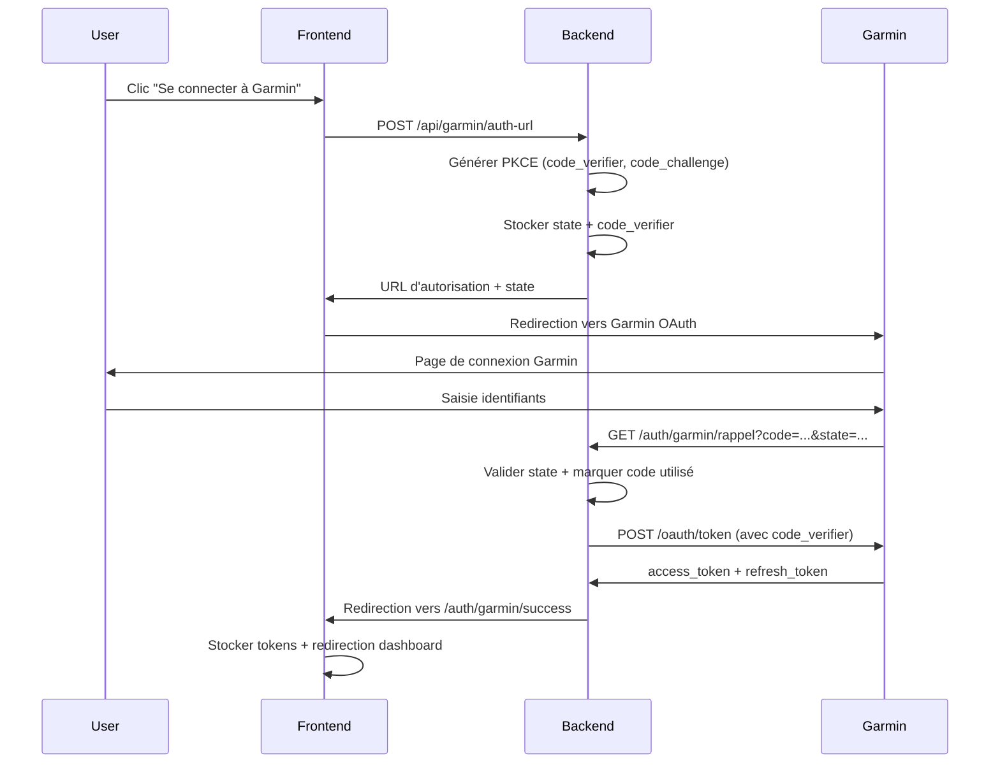

# Garmin OAuth 2.0 + PKCE Integration - Documentation

## Vue d'ensemble

Cette documentation décrit l'implémentation complète de l'intégration Garmin OAuth 2.0 avec PKCE (Proof Key for Code Exchange) pour l'application AVA.

## Configuration

### Credentials Garmin
```
Client ID: 9efacb80-abc5-41f3-8a01-207f9197aaaf
Client Secret: As/Aomzxc2dm+Nwq83elmAHa/uOFmfbxP6TVsOz4LzI
Redirect URI: https://witty-starfish-68.loca.lt/auth/garmin/rappel
```

### Variables d'environnement
```bash
GARMIN_CLIENT_ID=9efacb80-abc5-41f3-8a01-207f9197aaaf
GARMIN_CLIENT_SECRET=As/Aomzxc2dm+Nwq83elmAHa/uOFmfbxP6TVsOz4LzI
GARMIN_REDIRECT_URI=https://witty-starfish-68.loca.lt/auth/garmin/rappel
```

## Architecture OAuth 2.0 + PKCE

### 1. Flux d'autorisation



### 2. Sécurité PKCE

**Code Verifier**: Chaîne aléatoire de 43-128 caractères (base64url)
```javascript
const codeVerifier = crypto.randomBytes(32).toString('base64url');
```

**Code Challenge**: SHA256 du verifier encodé en base64url
```javascript
const codeChallenge = crypto.createHash('sha256').update(verifier).digest('base64url');
```

## Endpoints Backend

### POST /api/garmin/auth-url
Génère l'URL d'autorisation OAuth 2.0 avec PKCE.

**Réponse:**
```json
{
  "success": true,
  "authUrl": "https://connect.garmin.com/oauthConfirm?client_id=...&code_challenge=...",
  "state": "abc123...",
  "requestId": "def456..."
}
```

### GET /auth/garmin/rappel
Callback OAuth pour traiter le retour de Garmin.

**Paramètres:**
- `code`: Code d'autorisation Garmin
- `state`: Token de sécurité
- `error`: Erreur OAuth (optionnel)

**Redirections:**
- Succès: `/auth/garmin/success?access_token=...`
- Erreur: `/auth/garmin/error?error=...`

## Protection contre les attaques

### 1. Réutilisation de code
```javascript
// Marquer immédiatement le code comme utilisé
this.usedCodes.add(code);
this.pendingAuths.delete(state);
```

### 2. Validation du state
```javascript
const authData = this.pendingAuths.get(state);
if (!authData) {
  return res.redirect('/auth/garmin/error?error=invalid_state');
}
```

### 3. Expiration automatique
```javascript
// Nettoyage toutes les 5 minutes
setInterval(() => {
  const now = Date.now();
  for (const [key, data] of this.pendingAuths.entries()) {
    if (now - data.timestamp > 10 * 60 * 1000) { // 10 min
      this.pendingAuths.delete(key);
    }
  }
}, 5 * 60 * 1000);
```

## Frontend - Prévention des appels multiples

### Debounce et état de chargement
```javascript
const connectGarmin = async () => {
  if (garminStatus.loading) return; // Prévenir clics multiples
  
  setGarminStatus(prev => ({ ...prev, loading: true }));
  await new Promise(resolve => setTimeout(resolve, 500)); // Debounce
  
  // ... logique OAuth
};
```

## Pages de gestion OAuth

### /auth/garmin/success
- Récupère les tokens depuis les paramètres URL
- Stocke dans localStorage
- Redirige vers le dashboard après 3s

### /auth/garmin/error
- Affiche l'erreur avec message explicite
- Boutons "Retour" et "Réessayer"

## Codes d'erreur

| Code | Description |
|------|-------------|
| `missing_parameters` | Paramètres OAuth manquants |
| `code_already_used` | Code d'autorisation déjà utilisé |
| `invalid_state` | Token de sécurité invalide |
| `rate_limit_exceeded` | Trop de tentatives (429) |
| `network_error` | Erreur de connexion |
| `internal_error` | Erreur serveur interne |

## Installation et test

### 1. Démarrer le tunnel
```bash
npx localtunnel --port 5003 --subdomain witty-starfish-68
```

### 2. Mettre à jour la console Garmin
Callback URL: `https://witty-starfish-68.loca.lt/auth/garmin/rappel`

### 3. Démarrer les serveurs
```bash
# Backend
node server.js

# Frontend
npm run dev
```

### 4. Tester le flux
1. Aller sur http://localhost:5173/dashboard
2. Cliquer "Se connecter à Garmin"
3. S'authentifier sur Garmin
4. Vérifier la redirection vers /auth/garmin/success
5. Confirmer les tokens dans localStorage

## Checklist de validation

### Chrome
- [ ] Connexion OAuth complète
- [ ] Tokens stockés correctement
- [ ] Pas d'erreur 429
- [ ] Redirection dashboard fonctionne

### Safari
- [ ] Désactiver "Prévenir le suivi intersite"
- [ ] Autoriser cookies tiers pour loca.lt
- [ ] Tester le flux complet
- [ ] Vérifier localStorage accessible

### Logs à surveiller
```
[requestId] 🔗 Génération URL d'autorisation...
[requestId] 🔄 Callback OAuth reçu...
[requestId] 🔄 Échange du code contre un token...
[requestId] ✅ Token obtenu avec succès
```

## Production

### Stockage persistant
Remplacer `Map()` et `Set()` par Redis ou base de données:
```javascript
// Au lieu de this.pendingAuths = new Map()
await redis.setex(`pkce:${state}`, 600, JSON.stringify(authData));

// Au lieu de this.usedCodes = new Set()
await redis.setex(`used:${code}`, 600, 'true');
```

### Sécurité renforcée
- HTTPS obligatoire
- Validation des domaines de redirection
- Rate limiting par IP
- Monitoring des tentatives d'attaque

## Dépannage

### Erreur 429
- Vérifier que les codes ne sont pas réutilisés
- Attendre 10-15 minutes avant de réessayer
- Vérifier les logs pour les appels multiples

### Callback 404
- Vérifier que le tunnel est actif
- Confirmer l'URL dans la console Garmin
- Vérifier les routes backend

### State invalide
- Nettoyer le cache navigateur
- Redémarrer le serveur backend
- Vérifier l'expiration des données PKCE
